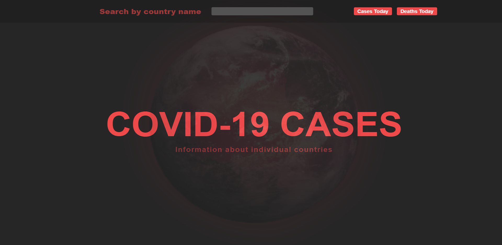
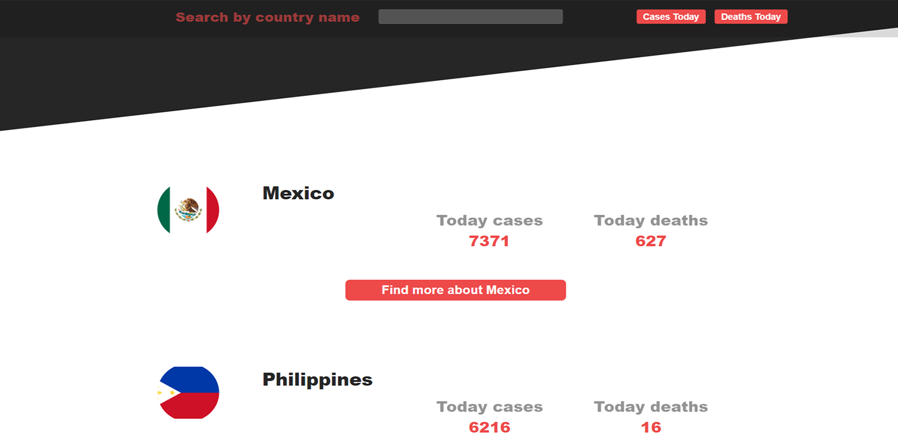
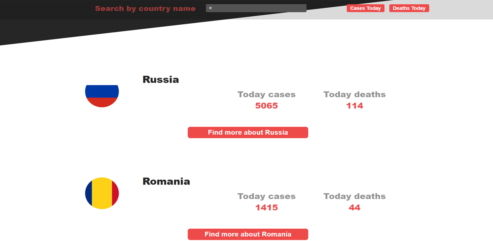
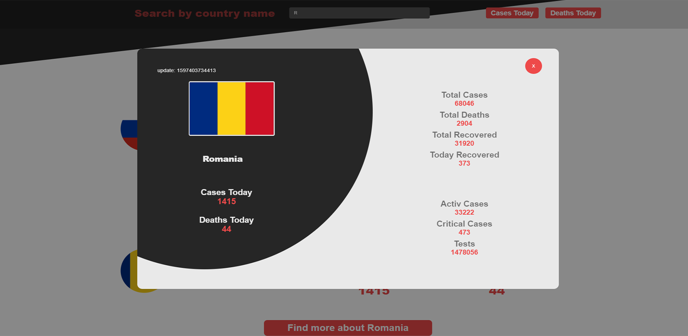

# Covid-19
 A project that shows the current situation of Covid-19 cases. Here you can search and see in depth information about a specific country.
 
 This project was made with Angular. The purpose of this was to learn how Angular works and how to consume a public API.
 I ended up by making a website that display the number of cases for each country. You can use the search field to search for a specific country, and the result will update as soon as you type. 
 The 'See more about ...' button, if  clicked, opens a window with in depth information about the country that you want. 
 The buttons from upper right corner works like a filter that arrange the results in ascendent/descendent order of the cases/deaths. 
 
 Hero Page:
 
 
 
 
 
 
 
